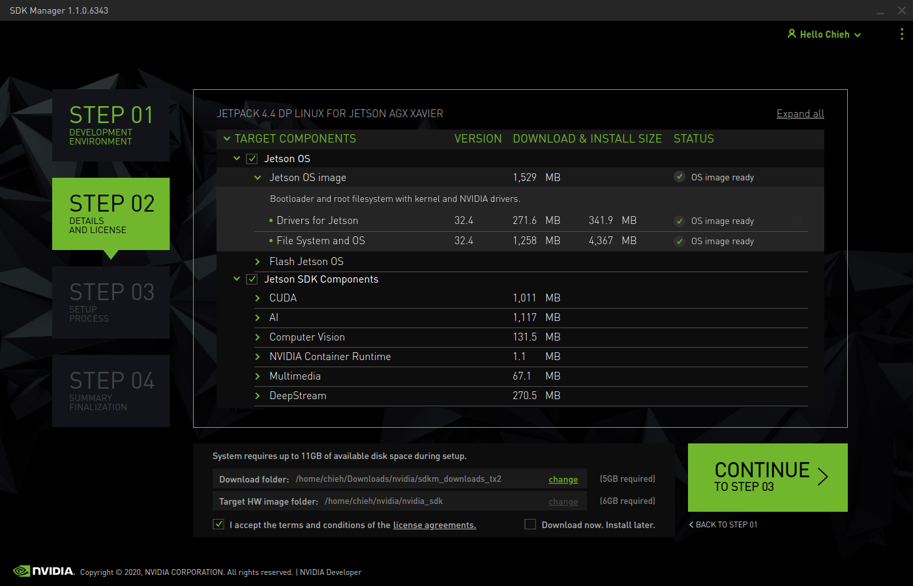
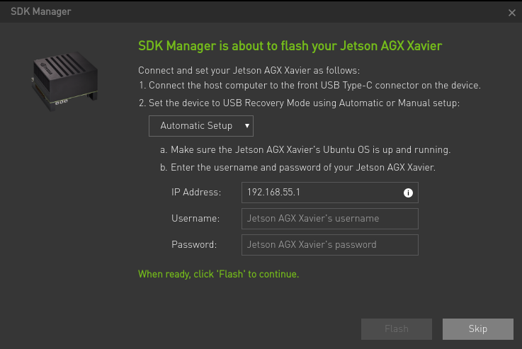
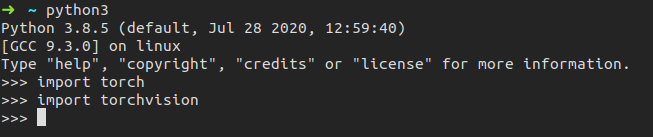

In this page, there is a detail record that how to set up the AGX from scratch.
There are some packages or tools which should be installed.

In my installation, I was installing `JetPack 4.4` and `SDK Manager 1.1.0.6343`. 

# Flash OS and install target components
   1. Go to download the [SDK manager](https://developer.nvidia.com/embedded/jetpack). 
   2. Choose which one `target operating system` you want to install. (JetPack version)
   3. Choose which components you want to install. (I suggest to select whole items.)
      
      We can see that very detail information including version, size and item name.
   4. Go to next step3 to start installing. 
      When we start to download the packages and install. You might meet this prompt below that ask you to type the username and password.
      
   > Press `POWER BUTTON` → Press `RECOVERY BUTTOM` over 3 seconds (Keep hold it) → Press `RESET BUTTON` and unclasp both at the same time.
   You have to login Jetson device to setup until your net can work well. On the other hand, in your host, please type this command `lsusb` on your terminal and check whether there is a `NVIDIA Corp` in the list or not. (Remind: Only one type-c port can connect to PC. So if you cannot find the `NVIDIA Corp`, you can change to another type-c port.)
   5. Come back to step 3. Enter your AGX's username / pd, and then keep going to install.
   6. Done.

   After we flashed and installed all components, AGX remained the 16.7GB / 29.5GB space.

   Reference:
   - [NVIDIA Jetson TX2學習筆記（一）:安裝JetPack 4.2.1](https://medium.com/@yanweiliu/nvidia-jetson-tx2%E5%AD%B8%E7%BF%92%E7%AD%86%E8%A8%98-%E4%B8%80-3dab5640968e)

   #### Version Information

   There are original versions after we installed the `JetPack 4.4`.
   ```
   TensorRT : 7.1.0.16
   Cmake : 3.10.2
   git version 2.17.1
   Python3 : 3.6.9
   ```

---
# Switch the rootfs to a NVMe SSD 

1. Before we switch the rootfs to a SSD, we have to done the normal flashing steps.
2. Format the SSD with `ext4` and no need to mount the SSD.
3. Clone the scripts from [rootOnNVMe](https://github.com/jetsonhacks/rootOnNVMe).
4. Run the `copy-rootfs-ssd.sh` 
5. Run the `setup-service.sh`

In these scripts, basically it will help us to mount the SSD and move the folder to SSD. Also, it will set the startup by SSD. 

---
# zsh & oh-my-zsh
Commands:
```
sudo apt-get update
sudo apt-get upgrade
sudo apt-get install zsh
```

Use this to check.
```
cat /etc/shells
```

Output:
```
# /etc/shells: valid login shells
/bin/sh
/bin/bash
/bin/rbash
/bin/dash
/bin/zsh
/usr/bin/zsh
nvidia@nvidia-
```

#### Download the `oh-my-zsh`

```
sh -c "$(wget https://raw.githubusercontent.com/robbyrussell/oh-my-zsh/master/tools/install.sh -O -)"
```

#### Change the initial shell of login

```
chsh -s /bin/zsh
```

#### Change the theme

I like this theme, [oh-my-zsh-bunnyruni-theme](https://github.com/jopcode/oh-my-zsh-bunnyruni-theme).

```
cd $ZSH_CUSTOM/themes/
git clone https://github.com/jopcode/oh-my-zsh-bunnyruni-theme.git
mv oh-my-zsh-bunnyruni-theme/bunnyruni.zsh-theme .
```

Set the theme in your `~/.zshrc` file
```
ZSH_THEME="bunnyruni"`
```

Reference:
- [在 Ubuntu 18.04 LTS / 16.04 LTS 中安裝使用 Oh-My-Zsh](https://medium.com/@wifferlin0505/%E5%9C%A8-ubuntu-16-04-lts-%E4%B8%AD%E5%AE%89%E8%A3%9D%E4%BD%BF%E7%94%A8-oh-my-zsh-cf92203ca8a2)

---
# VS code
As the Jetson device is ARM 64 machines, you should build the vs code from source.

```
git clone https://github.com/JetsonHacksNano/installVSCode.git
cd installVSCode
./installVSCode.sh
```

After installation, you can run VSCode by this command.
```
code-oss
```

Reference:
- [Jetson Nano – Visual Studio Code + Python](https://www.jetsonhacks.com/2019/10/01/jetson-nano-visual-studio-code-python/)

#### Install Plugins
1. [Better Comments](https://marketplace.visualstudio.com/items?itemName=aaron-bond.better-comments)
2. [Atom One Dark Theme](https://marketplace.visualstudio.com/items?itemName=akamud.vscode-theme-onedark)
3. [Power Mode](https://marketplace.visualstudio.com/items?itemName=hoovercj.vscode-power-mode)
4. [Python](https://marketplace.visualstudio.com/items?itemName=ms-python.python)
5. [Material Icon Theme](https://marketplace.visualstudio.com/items?itemName=PKief.material-icon-theme)
6. [TODO Highlight](https://marketplace.visualstudio.com/items?itemName=wayou.vscode-todo-highlight)
7. [Markdown All in One](https://marketplace.visualstudio.com/items?itemName=yzhang.markdown-all-in-one)

---
# Install Libraries
```
sudo apt-get install python3-pip
python3 -m pip install --upgrade pip setuptools wheel
sudo -H pip3 install jetson-stats
```

```
sudo apt-get update
sudo apt-get install -y build-essential libatlas-base-dev gfortran libfreetype6-dev python3-setuptools
sudo apt-get install -y protobuf-compiler libprotobuf-dev openssl libssl-dev libcurl4-openssl-dev

pip3 install matplotlib
```

#### Upgrade Cmake version
(original version is 3.10.2). Follow [here](https://forums.developer.nvidia.com/t/indexerror-list-index-out-of-range-object-detection-and-instance-segmentations-with-a-tensorflow-ma/108306/7?u=chieh).

>cmake version 3.13.0 

```
sudo wget http://www.cmake.org/files/v3.13/cmake-3.13.0.tar.gz
tar xpvf cmake-3.13.0.tar.gz cmake-3.13.0/
cd cmake-3.13.0/
sudo ./bootstrap --system-curl
sudo make -j8
echo 'export PATH=/home/nvidia/cmake-3.13.0/bin/:$PATH' >> ~/.zshrc
source ~/.zshrc
```

If you encounter the issue like below:

```bash
$ sudo ./bootstrap --system-curl
---------------------------------------------
CMake 3.13.0, Copyright 2000-2018 Kitware, Inc. and Contributors
Found GNU toolchain
C compiler on this system is: gcc       
C++ compiler on this system is: g++          
Makefile processor on this system is: make
g++ has setenv
g++ has unsetenv
g++ does not have environ in stdlib.h
g++ has stl wstring
g++ has <ext/stdio_filebuf.h>
---------------------------------------------
make: 'cmake' is up to date.
loading initial cache file /home/nvidia/cmake-3.13.0/Bootstrap.cmk/InitialCacheFlags.cmake
-- Using system-installed CURL
-- Using system-installed ZLIB
-- Could NOT find CURL (missing: CURL_LIBRARY CURL_INCLUDE_DIR) 
CMake Error at CMakeLists.txt:404 (message):
  CMAKE_USE_SYSTEM_CURL is ON but a curl is not found!
Call Stack (most recent call first):
  CMakeLists.txt:685 (CMAKE_BUILD_UTILITIES)


-- Configuring incomplete, errors occurred!
See also "/home/nvidia/cmake-3.13.0/CMakeFiles/CMakeOutput.log".
See also "/home/nvidia/cmake-3.13.0/CMakeFiles/CMakeError.log".
---------------------------------------------
Error when bootstrapping CMake:
Problem while running initial CMake
---------------------------------------------
```

Solution:

```bash
sudo apt-get install libcurl4-openssl-dev
```

#### Install scipy

>scipy version 1.3.3 

```
wget https://github.com/scipy/scipy/releases/download/v1.3.3/scipy-1.3.3.tar.gz
tar -xzvf scipy-1.3.3.tar.gz scipy-1.3.3
cd scipy-1.3.3/
python3 setup.py install --user
```

#### Options

```
sudo apt autoremove
```

#### Install onnx

```
sudo apt-get install python3-pip libprotoc-dev protobuf-compiler
pip3 install onnx --verbose
```

Reference: From [here](https://forums.developer.nvidia.com/t/installing-onnx-library-on-my-jetson-xavier/115229/2?u=chieh)

---
# Install PyTorch

Please check this [instructions](https://forums.developer.nvidia.com/t/pytorch-for-jetson-nano-version-1-5-0-now-available/72048).

You can also check my [notes](../Pytorch/README.md).

>torch version 1.5.0

```
wget https://nvidia.box.com/shared/static/3ibazbiwtkl181n95n9em3wtrca7tdzp.whl -O torch-1.5.0-cp36-cp36m-linux_aarch64.whl
sudo -H python3 -m pip install Cython
sudo -H python3 -m pip install torch-1.5.0-cp36-cp36m-linux_aarch64.whl
sudo apt-get install python3-pip libopenblas-base libopenmpi-dev 
```

#### Install torchvision

```
sudo apt-get install libjpeg-dev zlib1g-dev
git clone --branch <version> https://github.com/pytorch/vision torchvision
```

>PyTorch v1.5 - torchvision v0.6.0

```
git clone --branch v0.6.0 https://github.com/pytorch/vision torchvision
cd torchvision
sudo -H python3 setup.py install
cd ..
sudo -H python3 -m pip install 'pillow<7' 
```

It installed the version 6.2.2 of pillow in the end.


▍Update [2021/08/17]

Tried to install again with this version, but it could not work anymore.
Hence, I upgraded the version of Torch as `v1.8.0` and TorchVersion as `v0.9.0`.

Steps for torch:

```
wget https://nvidia.box.com/shared/static/p57jwntv436lfrd78inwl7iml6p13fzh.whl -O torch-1.8.0-cp36-cp36m-linux_aarch64.whl
sudo apt-get install python3-pip libopenblas-base libopenmpi-dev 
pip3 install Cython
pip3 install numpy torch-1.8.0-cp36-cp36m-linux_aarch64.whl
```

Steps for torchvision:

```
sudo apt-get install libjpeg-dev zlib1g-dev libpython3-dev libavcodec-dev libavformat-dev libswscale-dev
git clone --branch v0.9.0 https://github.com/pytorch/vision torchvision   
cd torchvision
export BUILD_VERSION=0.9.0 
python3 setup.py install --user
cd ../  # attempting to load torchvision from build dir will result in import error
pip install 'pillow<7' # always needed for Python 2.7, not needed torchvision v0.5.0+ with Python 3.6
```

Source: Check [here](https://forums.developer.nvidia.com/t/pytorch-for-jetson-version-1-9-0-now-available/72048)

# Install Onnxruntime

I followed from [here](https://github.com/microsoft/onnxruntime/blob/master/BUILD.md#jetson-tx1tx2nano-arm64-builds).

```
git clone --single-branch --recursive --branch v1.1.2 https://github.com/Microsoft/onnxruntime
```

**Important:**
```
export CUDACXX="/usr/local/cuda/bin/nvcc"
```

To modify some places.
```
Modify  tools/ci_build/build.py
    - "-Donnxruntime_DEV_MODE=" + ("OFF" if args.android else "ON"),
    + "-Donnxruntime_DEV_MODE=" + ("OFF" if args.android else "OFF"),
Modify cmake/CMakeLists.txt
    -  set(CMAKE_CUDA_FLAGS "${CMAKE_CUDA_FLAGS} -gencode=arch=compute_50,code=sm_50") # M series
    +  set(CMAKE_CUDA_FLAGS "${CMAKE_CUDA_FLAGS} -gencode=arch=compute_53,code=sm_53") # Jetson support
    -  set(CMAKE_CUDA_FLAGS "${CMAKE_CUDA_FLAGS} -gencode=arch=compute_70,code=sm_70")
    +  set(CMAKE_CUDA_FLAGS "${CMAKE_CUDA_FLAGS} -gencode=arch=compute_72,code=sm_72") # AGX
```

If you only do it and build it, you might get this known error below.

```
/home/nvidia/onnxruntime/cmake/external/eigen/Eigen/src/Core/products/GeneralBlockPanelKernel.h:1148:71: warning: unused parameter ‘dest’ [-Wunused-parameter]
   EIGEN_STRONG_INLINE void updateRhs(const RhsScalar* b, RhsPacketx4& dest) const
                                                                       ^~~~
CMakeFiles/onnxruntime_providers_cuda.dir/build.make:465: recipe for target 'CMakeFiles/onnxruntime_providers_cuda.dir/home/nvidia/onnxruntime/onnxruntime/core/providers/cuda/rnn/cudnn_rnn_base.cc.o' failed
make[2]: *** [CMakeFiles/onnxruntime_providers_cuda.dir/home/nvidia/onnxruntime/onnxruntime/core/providers/cuda/rnn/cudnn_rnn_base.cc.o] Error 1
CMakeFiles/Makefile2:952: recipe for target 'CMakeFiles/onnxruntime_providers_cuda.dir/all' failed
make[1]: *** [CMakeFiles/onnxruntime_providers_cuda.dir/all] Error 2
Makefile:162: recipe for target 'all' failed
make: *** [all] Error 2
Traceback (most recent call last):
  File "/home/nvidia/onnxruntime/tools/ci_build/build.py", line 1043, in <module>
    sys.exit(main())
  File "/home/nvidia/onnxruntime/tools/ci_build/build.py", line 975, in main
    build_targets(cmake_path, build_dir, configs, args.parallel)
  File "/home/nvidia/onnxruntime/tools/ci_build/build.py", line 415, in build_targets
    run_subprocess(cmd_args)
  File "/home/nvidia/onnxruntime/tools/ci_build/build.py", line 197, in run_subprocess
    completed_process = subprocess.run(args, cwd=cwd, check=True, stdout=stdout, stderr=stderr, env=my_env, shell=shell)
  File "/usr/lib/python3.6/subprocess.py", line 438, in run
    output=stdout, stderr=stderr)
subprocess.CalledProcessError: Command '['/home/nvidia/cmake-3.13.0/bin/cmake', '--build', '/home/nvidia/onnxruntime/build/Linux/Release', '--config', 'Release']' returned non-zero exit status 2.
```

**Please check here to modify the document.**

>Check [here](https://forums.developer.nvidia.com/t/jetson-nano-parsed-tiny-yolo-v2-onnx-model-gives-different-result-in-trt/122721/6?u=chieh)

Open the `onnxruntime/onnxruntime/core/providers/cuda/rnn/cudnn_rnn_base.h` file, and find at line 45. 
```
    // CUDNN_RETURN_IF_ERROR(cudnnSetRNNDescriptor(cudnnHandle,
    //                                             cudnn_rnn_desc_,
    //                                             gsl::narrow_cast<int>(hidden_size),
    //                                             num_layers,
    //                                             cudnn_dropout_desc,
    //                                             CUDNN_LINEAR_INPUT,  // We can also skip the input matrix transformation
    //                                             cudnn_direction_model,
    //                                             rnn_mode,
    //                                             CUDNN_RNN_ALGO_STANDARD,  //CUDNN_RNN_ALGO_PERSIST_STATIC, CUDNN_RNN_ALGO_PERSIST_DYNAMIC
    //                                             dataType));
    CUDNN_RETURN_IF_ERROR(cudnnSetRNNDescriptor_v6(cudnnHandle,
                                                   cudnn_rnn_desc_,
                                                   gsl::narrow_cast<int>(hidden_size),
                                                   num_layers,
                                                   cudnn_dropout_desc,
                                                   CUDNN_LINEAR_INPUT,  // We can also skip the input matrix transformation
                                                   cudnn_direction_model,
                                                   rnn_mode,
                                                   CUDNN_RNN_ALGO_STANDARD,  //CUDNN_RNN_ALGO_PERSIST_STATIC, CUDNN_RNN_ALGO_PERSIST_DYNAMIC
                                                   dataType));
```
Save and quit it.

**Start to build it.**

```
sudo ./build.sh --config Release --update --build --build_wheel --use_tensorrt --cuda_home /usr/local/cuda --cudnn_home /usr/lib/aarch64-linux-gnu --tensorrt_home /usr/lib/aarch64-linux-gnu
```

Output:
```
Copying onnxruntime_gpu_tensorrt.egg-info to build/bdist.linux-aarch64/wheel/onnxruntime_gpu_tensorrt-1.1.2.data/purelib/onnxruntime_gpu_tensorrt-1.1.2-py3.6.egg-info
running install_scripts
creating build/bdist.linux-aarch64/wheel/onnxruntime_gpu_tensorrt-1.1.2.dist-info/WHEEL
creating 'dist/onnxruntime_gpu_tensorrt-1.1.2-cp36-cp36m-linux_aarch64.whl' and adding 'build/bdist.linux-aarch64/wheel' to it
adding 'onnxruntime_gpu_tensorrt-1.1.2.data/purelib/onnxruntime/LICENSE'
adding 'onnxruntime_gpu_tensorrt-1.1.2.data/purelib/onnxruntime/Privacy.md'
adding 'onnxruntime_gpu_tensorrt-1.1.2.data/purelib/onnxruntime/ThirdPartyNotices.txt'
adding 'onnxruntime_gpu_tensorrt-1.1.2.data/purelib/onnxruntime/__init__.py'
adding 'onnxruntime_gpu_tensorrt-1.1.2.data/purelib/onnxruntime/backend/__init__.py'
adding 'onnxruntime_gpu_tensorrt-1.1.2.data/purelib/onnxruntime/backend/backend.py'
adding 'onnxruntime_gpu_tensorrt-1.1.2.data/purelib/onnxruntime/backend/backend_rep.py'
adding 'onnxruntime_gpu_tensorrt-1.1.2.data/purelib/onnxruntime/capi/__init__.py'
adding 'onnxruntime_gpu_tensorrt-1.1.2.data/purelib/onnxruntime/capi/_ld_preload.py'
adding 'onnxruntime_gpu_tensorrt-1.1.2.data/purelib/onnxruntime/capi/_pybind_state.py'
adding 'onnxruntime_gpu_tensorrt-1.1.2.data/purelib/onnxruntime/capi/onnxruntime_pybind11_state.so'
adding 'onnxruntime_gpu_tensorrt-1.1.2.data/purelib/onnxruntime/capi/onnxruntime_validation.py'
adding 'onnxruntime_gpu_tensorrt-1.1.2.data/purelib/onnxruntime/capi/session.py'
adding 'onnxruntime_gpu_tensorrt-1.1.2.data/purelib/onnxruntime/datasets/__init__.py'
adding 'onnxruntime_gpu_tensorrt-1.1.2.data/purelib/onnxruntime/datasets/logreg_iris.onnx'
adding 'onnxruntime_gpu_tensorrt-1.1.2.data/purelib/onnxruntime/datasets/mul_1.onnx'
adding 'onnxruntime_gpu_tensorrt-1.1.2.data/purelib/onnxruntime/datasets/sigmoid.onnx'
adding 'onnxruntime_gpu_tensorrt-1.1.2.data/purelib/onnxruntime/tools/__init__.py'
adding 'onnxruntime_gpu_tensorrt-1.1.2.data/purelib/onnxruntime/tools/onnxruntime_test.py'
adding 'onnxruntime_gpu_tensorrt-1.1.2.dist-info/METADATA'
adding 'onnxruntime_gpu_tensorrt-1.1.2.dist-info/WHEEL'
adding 'onnxruntime_gpu_tensorrt-1.1.2.dist-info/entry_points.txt'
adding 'onnxruntime_gpu_tensorrt-1.1.2.dist-info/top_level.txt'
adding 'onnxruntime_gpu_tensorrt-1.1.2.dist-info/RECORD'
removing build/bdist.linux-aarch64/wheel
2020-06-09 21:49:04,747 Build [DEBUG] - Subprocess completed. Return code=0
2020-06-09 21:49:04,749 Build [INFO] - Build complete
```

Check files and install .whl

Command:
```
$ ls -l build/Linux/Release/*.so

-rwxrwxr-x 1 nvidia nvidia    44392     9 17:13 build/Linux/Release/libcustom_op_library.so
-rwxrwxr-x 1 nvidia nvidia 66185368     9 21:46 build/Linux/Release/onnxruntime_pybind11_state.so

$ ls -l build/Linux/Release/dist/*.whl

-rw-rw-r-- 1 nvidia nvidia 15594036     9 21:49 build/Linux/Release/dist/onnxruntime_gpu_tensorrt-1.1.2-cp36-cp36m-linux_aarch64.whl

$ sudo -H python3 -m pip install ./build/Linux/Release/dist/onnxruntime_gpu_tensorrt-1.1.2-cp36-cp36m-linux_aarch64.whl 

Processing ./build/Linux/Release/dist/onnxruntime_gpu_tensorrt-1.1.2-cp36-cp36m-linux_aarch64.whl
Installing collected packages: onnxruntime-gpu-tensorrt
Successfully installed onnxruntime-gpu-tensorrt-1.1.2
```

Check it on python3. You can follow [here](https://github.com/chiehpower/Installation/tree/master/onnxruntime#check-it).

```
$ python3

Python 3.6.9 (default, Apr 18 2020, 01:56:04) 
[GCC 8.4.0] on linux
Type "help", "copyright", "credits" or "license" for more information.
>>> import onnxruntime
>>> onnxruntime.__version__
'1.1.2'
```

Done

**NOTE: Make sure the onnxruntime version which can support the TensorRT version.** 

For TensorRT v7.0 up , it needs to use the onnxruntime v1.2.0 up.

Source : https://github.com/microsoft/onnxruntime/blob/v1.6.0/BUILD.md#nvidia-jetson-tx1tx2nanoxavier

```
git clone --recursive https://github.com/microsoft/onnxruntime

export CUDACXX="/usr/local/cuda/bin/nvcc"

sudo apt install -y --no-install-recommends   build-essential software-properties-common libopenblas-dev   libpython3.6-dev python3-pip python3-dev python3-setuptools python3-wheel 

./build.sh --config Release --update --build --parallel --build_wheel \
--use_tensorrt --cuda_home /usr/local/cuda --cudnn_home /usr/lib/aarch64-linux-gnu \
--tensorrt_home /usr/lib/aarch64-linux-gnu

sudo -H python3 -m pip install ./build/Linux/Release/dist/onnxruntime_gpu_tensorrt-1.7.0-cp36-cp36m-linux_aarch64.whl
```

Test it:
```
Python 3.6.9 (default, Jan 26 2021, 15:33:00) 
[GCC 8.4.0] on linux
Type "help", "copyright", "credits" or "license" for more information.
>>> import onnxruntime
>>> 
```

Done~

*Note: This method also works for python3.8 on Ubuntu 20.04*


##  Troubleshooting

#### The error happens during the building stage

About : **CMAKE_CUDA_COMPILER**
<details><summary> more </summary>

```
DCUDA_CUDA_LIBRARY=/usr/local/cuda/lib64/stubs', '-Donnxruntime_PYBIND_EXPORT_OPSCHEMA=OFF', '-DCMAKE_BUILD_TYPE=Release']
-- The CUDA compiler identification is unknown
CMake Error at CMakeLists.txt:612 (enable_language):
  No CMAKE_CUDA_COMPILER could be found.

  Tell CMake where to find the compiler by setting either the environment
  variable "CUDACXX" or the CMake cache entry CMAKE_CUDA_COMPILER to the full
  path to the compiler, or to the compiler name if it is in the PATH.
```

### Solution:

Check [here](https://github.com/jetsonhacks/buildLibrealsense2TX/issues/13#issue-352028207)

Open the file, **/etc/environment **, and add this line:
```
CUDACXX=/usr/local/cuda/bin/nvcc
```

Then you can try again~

</details>


---
# Expand the SSD

Please check [my video](https://youtu.be/d6uuF-sbQrA).

The configuration was `GIGABYTE SSD 256GB NVMe M.2 2280`.

# Install Onnx2trt
Source from [here](https://github.com/chiehpower/Installation/tree/master/onnx2trt#command); however, as the JetPack is different with previous what I installed, so I modified some places.

Command:

```
git clone https://github.com/onnx/onnx-tensorrt.git && cd onnx-tensorrt
git submodule update --init --recursive   
cmake . -DCUDA_INCLUDE_DIRS=/usr/local/cuda/include -DTENSORRT_ROOT=/usr/src/tensorrt
make 
sudo make install
```

# Install Pycuda

**Install requirements**
```
sudo apt-get install -y build-essential python3-dev
sudo apt-get install -y libboost-python-dev libboost-thread-dev
sudo -H python3 -m pip install setuptools 
```

Run this [file](https://github.com/jkjung-avt/tensorrt_demos/blob/master/ssd/install_pycuda.sh). (Comment the lines from 7 to 10.

Output:

```
[SKIP]

Using /home/nvidia/.local/lib/python3.6/site-packages
Searching for numpy==1.13.3
Best match: numpy 1.13.3
Adding numpy 1.13.3 to easy-install.pth file

Using /usr/lib/python3/dist-packages
Searching for six==1.11.0
Best match: six 1.11.0
Adding six 1.11.0 to easy-install.pth file

Using /usr/lib/python3/dist-packages
Finished processing dependencies for pycuda==2019.1.2
~/ssd256/github/tensorrt_demos/ssd
pycuda version: (2019, 1, 2)
```

Done

>torch version 2019.1.2

# Install Opencv for python

Basically we have two ways to install opencv in Jetson devices.

First one is using `pip` to install and it can be suitable for a majority of situations.

```
python3 -m pip install opencv-python==4.3.0.38 opencv-python-headless==4.3.0.38
```
Work with the numpy v1.19.2

Sometimes you will meet some errors that you might need to install some libraries and you can try these commands below:

```
sudo apt-get update -y && sudo apt-get install -y libgl1-mesa-dev libglib2.0-0
```

>Note: Some version will encounter crash; hence, you can downgrade the version.
(from versions: 3.4.10.37, 3.4.11.39, 3.4.11.41, 3.4.11.43, 3.4.11.45, 3.4.13.47, 4.3.0.38, 4.4.0.40, 4.4.0.42, 4.4.0.44, 4.4.0.46, 4.5.1.48)

Second way is to install from scoure. Please check this [post](https://www.jetsonhacks.com/2018/11/08/build-opencv-3-4-on-nvidia-jetson-agx-xavier-developer-kit/)


---
# ▍Setup Ubuntu 20.04 with Python 3.8 on Jetson devices

Here is another different environment for Jetson devices.

(The manipulation was in the container of jetson devices.)

> Environment info:
> - OS : Ubuntu 20.04 based on JetPack 4.4
> - Python : 3.8

## Introduction

Here are my successful steps of installing Pytorch and TorchVision by Python3.8 on Ubuntu 20.04 (in the container) on AGX / NX devices.

For the Pytorch part, I referred to [this comment](https://forums.developer.nvidia.com/t/install-pytorch-with-python-3-8-on-jetpack-4-4-1/160060/3) and it can work well in my environment. However, it didn’t mention how to install the Torchvision part. Hence, you can try to use these commands to install torchvision.

## The steps of building pytorch v1.7


```
git clone --recursive --branch 1.7 http://github.com/pytorch/pytorch
cd pytorch
python3.8 -m pip install -r requirements.txt
python3.8 setup.py install
```

The building time will take almost over 6 hours on arm devices.

Here are my partial outputs.
```
byte-compiling /usr/local/lib/python3.8/dist-packages/caffe2/proto/hsm_pb2.py to hsm_pb2.cpython-38.pyc
byte-compiling /usr/local/lib/python3.8/dist-packages/caffe2/proto/torch_pb2.py to torch_pb2.cpython-38.pyc
byte-compiling /usr/local/lib/python3.8/dist-packages/caffe2/proto/caffe2_legacy_pb2.py to caffe2_legacy_pb2.cpython-38.pyc
byte-compiling /usr/local/lib/python3.8/dist-packages/caffe2/proto/metanet_pb2.py to metanet_pb2.cpython-38.pyc
byte-compiling /usr/local/lib/python3.8/dist-packages/caffe2/proto/caffe2_pb2.py to caffe2_pb2.cpython-38.pyc
running install_egg_info
running egg_info
writing torch.egg-info/PKG-INFO
writing dependency_links to torch.egg-info/dependency_links.txt
writing entry points to torch.egg-info/entry_points.txt
writing requirements to torch.egg-info/requires.txt
writing top-level names to torch.egg-info/top_level.txt
reading manifest file 'torch.egg-info/SOURCES.txt'
writing manifest file 'torch.egg-info/SOURCES.txt'
removing '/usr/local/lib/python3.8/dist-packages/torch-1.7.0a0.egg-info' (and everything under it)
Copying torch.egg-info to /usr/local/lib/python3.8/dist-packages/torch-1.7.0a0.egg-info
running install_scripts
Installing convert-caffe2-to-onnx script to /usr/local/bin
Installing convert-onnx-to-caffe2 script to /usr/local/bin
```

And test in other places.

## The steps of building torchvision (should be with v0.8)

The cuda version is `10.2`.
```
export CUDA_HOME=/usr/local/cuda
export LD_LIBRARY_PATH=$LD_LIBRARY_PATH:/usr/local/cuda/lib64:/usr/local/cuda/extras/CUPTI/lib64
export PATH=$PATH:$CUDA_HOME/bin

sudo apt-get install libjpeg-dev zlib1g-dev
git clone https://github.com/pytorch/vision.git
git checkout v0.8.1-rc1
sudo -H python3 setup.py install
```

Done.

Test it:



**Note:** That one was installed in the container. My host of the jetson device was still OS 18.04 and python 3.6. (JetPack v4.4)

---
# Build a container for deep learning on AGX devices

If you wanna work in the container, you can build from my dockerfile.
Basically the image was already installed the packages about the environment of deep learning use.

### Commands:

1. Build images
```
docker build -t ai-container/l4t-ml:4.4 .
```
2. Run it and exec it
```
docker run -idt --gpus all -p 5000:5000 -p 8501:8501 --name=ai-container l4t-ml:4.4
docker exec -ti ai-container /bin/bash
```

---
The default numpy version is `numpy (1.19.2)`.

The based image is from `nvcr.io/nvidia/l4t-ml:r32.4.4-py3`.

