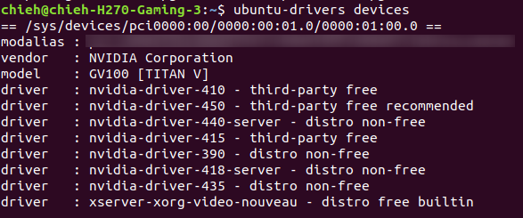
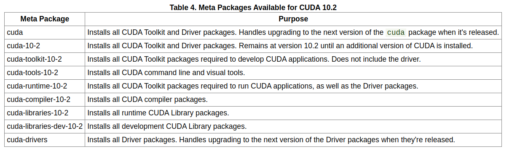

[](./) [](https://developer.nvidia.com/cuda-10.0-download-archive?target_os=Linux&target_arch=x86_64&target_distro=Ubuntu&target_version=1804&target_type=deblocal) [](https://developer.nvidia.com/rdp/cudnn-download) [](https://developer.nvidia.com/nvidia-tensorrt-7x-download) [](./)

[English](./) | [中文](./Mandarin/README.md)

---
# The list 

- Install onnx2trt: [Check here](./onnx2trt/README.md)
- Install onnxruntime: [Check here](./onnxruntime/README.md)
- Install onnx-simplifier: [Check here](./onnx-simplifier/README.md)
- Install Pytorch: [Check here](./Pytorch/README.md)
- Install NVIDIA-docker: [Check here](./NVIDIA-docker/README.md)
- Set up AGX: [Check here](./AGX/README.md)
- Install Tesseract: [Check here](./Tesseract/README.md)
- Install Bazel: [Check here](./Bazel/README.md)
- Test Triton-Inference-Server: [Check here](./Triton-inference-server/README.md)
- Docker_Installation : [Check here](./Docker_Installation/README.md)
- Install NVIDIA Apex : [Check here](./NVIDIA-Apex/README.md)

---
# Table of Contents
- Install / Remove CUDA and cudnn
  - Remove
  - Install CUDA
  - Install cudnn
  - Check it
- Install TensorRT
- onnx2trt
- onnxruntime
- onnx-simplifier
- Pytorch
- AGX
- NVIDIA-docker
- Tesseract
- Bazel
- Triton-Inference-Server
- Docker-Installation 
- NVIDIA Apex

---
# Install NVIDIA GPU Driver 

First, we need to add repository into your system.
```
sudo add-apt-repository ppa:graphics-drivers/ppa
```
Second, update it.
```
sudo apt update
```
Then we can check our gpu which one driver is suitable for us to install.
```
ubuntu-drivers devices
```
The info should be like below:



So I chose 450 this one driver. 
```
sudo apt install nvidia-driver-450
```
Done~


# Install / Remove CUDA and cudnn

## Remove

(My original version is 10.1, so I remove the folder cuda-10.1)

```
sudo apt-get remove cuda-10.1 
sudo apt autoremove
```

After the steps above, go to `/etc/apt/sources.list.d` and remove those files which are relevant with the words of CUDA.

```
sudo rm cuda.list 
```

## Install CUDA

1. First, download the .deb file from here. 
	https://developer.nvidia.com/cuda-10.0-download-archive?target_os=Linux&target_arch=x86_64&target_distro=Ubuntu&target_version=1804&target_type=deblocal
2. sudo dpkg -i cuda-repo-ubuntu1804-10-0-local-10.0.130-410.48_1.0-1_amd64.deb
3. sudo apt-key add /var/cuda-repo-10-0-local-10.0.130-410.48/7fa2af80.pub 
4. sudo apt-get update
5. sudo apt-get install cuda
6. sudo apt-get install cuda-libraries-dev-10-0 
> Other installation options are available in the form of meta-packages. For example, to install all the library packages, replace "cuda" with the "cuda-libraries-10-0" meta package. For more information on all the available meta packages click [here](https://docs.nvidia.com/cuda/cuda-installation-guide-linux/index.html#package-manager-metas).
7. sudo apt-get install cuda-libraries-10-0 
8. sudo apt-get install cuda-runtime-10-0
9. sudo apt-get install cuda-toolkit-10-0
10. sudo apt-get install cuda-10-0

**Please don't forget to add the path of CUDA in .zshrc or .bashrc.**

```
export LD_LIBRARY_PATH=$LD_LIBRARY_PATH:/usr/local/cuda-10.0/lib64
export CUDA_INSTALL_DIR=/usr/local/cuda-10.0
export PATH=$PATH:/usr/local/cuda-10.0/bin
export CUDA_HOME=$CUDA_HOME:/usr/local/cuda-10.0
export PATH=/usr/local/cuda-10.0/bin${PATH:+:${PATH}}
export LD_LIBRARY_PATH=/usr/local/cuda-10.0/lib64${LD_LIBRARY_PATH:+:${LD_LIBRARY_PATH}}
```

## Install cudnn
Download from : https://developer.nvidia.com/rdp/cudnn-download
(Recommend to download the .tar file.)

Copy these files to the folder of `/cuda/include/` and `/cuda/lib64/`

```
> sudo cp cuda/include/cudnn.h /usr/local/cuda/include/
> sudo cp cuda/lib64/lib* /usr/local/cuda/lib64/
```
Go to the folder of `/usr/local/cuda/lib64/` 
```
cd /usr/local/cuda/lib64/
```
Build the symbolic link (You need to use your version number instead of 7.6.5 if your version is different with mine.)
```
sudo chmod +r libcudnn.so.7.6.5
sudo ln -sf libcudnn.so.7.3.1 libcudnn.so.7
sudo ln -sf libcudnn.so.7 libcudnn.so
sudo ldconfig
```

## Check it

```
nvidia-smi
```

```
nvcc -V
```

### NOTE: CUDA Version 10.2


After you install the cuda and cudnn as followed official instructions, you meet some problems about cuda libs while you are running some python packages.
For example, `OSError: libcublas.so.10.0: cannot open shared object file: No such file or directory`

Please try this.

```
sudo ln -sf /usr/local/cuda/lib64/libcudnn.so.8.0. /usr/local/cuda/lib64/libcudnn.so.8

sudo ln -s /usr/local/cuda-10.2/lib64/libcudart.so.10.2 /usr/lib
sudo ln -s /usr/local/cuda-10.2/lib64/libcudart.so.10.2 /usr/lib/libcudart.so.10.1
sudo ln -s /usr/local/cuda-10.2/lib64/libcudart.so.10.2 /usr/lib/libcudart.so.10.0
sudo ldconfig

sudo apt-get install cuda-libraries-10-0
```

---
# Install TensorRT

The latest version is TensorRT 7.
We download the TensorRT version 7 from [here](https://developer.nvidia.com/nvidia-tensorrt-7x-download). (You need to login your account.)

My system is `Ubunty 18.04`, `cuDNN version 7.6.5` and `CUDA version 10.0`. I recommend you to install by tar package.

So I chose this tar package. If your version setting is same with me. You can download from here directly.
[TensorRT 7.0.0.11 for Ubuntu 18.04 and CUDA 10.0 tar package](https://developer.nvidia.com/compute/machine-learning/tensorrt/secure/7.0/7.0.0.11/tars/TensorRT-7.0.0.11.Ubuntu-18.04.x86_64-gnu.cuda-10.0.cudnn7.6.tar.gz)

Extract it.
```
tar -zxvf TensorRT-7.0.0.11.Ubuntu-18.04.x86_64-gnu.cuda-10.0.cudnn7.6.tar.gz
```

Please follow this [instruction](https://docs.nvidia.com/deeplearning/sdk/tensorrt-install-guide/index.html). 
According to my case, I followed [this part](https://docs.nvidia.com/deeplearning/sdk/tensorrt-install-guide/index.html#installing-tar).

First, we go into your TensorRT folder.
```
cd TensorRT7
```

## Install the Python TensorRT wheel file

```
cd ./python
sudo pip3 install tensorrt-*-cp3x-none-linux_x86_64.whl
cd ..
```

## Install the Python UFF wheel file. This is only required if you plan to use TensorRT with TensorFlow

```
cd ./uff
sudo pip3 install uff-0.6.5-py2.py3-none-any.whl
which convert-to-uff
cd ..
```

## Install the Python `graphsurgeon` wheel file.

```
cd ./graphsurgeon
sudo pip3 install graphsurgeon-0.4.1-py2.py3-none-any.whl
cd ..
```

## Export your path of TensorRT lib

1. Open your .bashrc / .zshrc
	```
	vim ~/.bashrc
	```
	or 
	```
	vim ~/.zshrc
	```
2. Add it by your location
	```
	LD_LIBRARY_PATH=$LD_LIBRARY_PATH:/home/(your location)/TensorRT7/lib
	export TRT_RELEASE=/home/(your location)/TensorRT7_cuda100
	```
3. Source it
	```
	source ~/.bashrc
	```
	or 
	```
	source ~/.zshrc
	```

## Check it

You can use python version 3 to test on your command line.
```
import tensorrt
```
It should not happen any wrong.

You can also check by those samples on `~/TensorRT7/samples/` which are C++ samples and `~/TensorRT7/samples/python` which are python samples.

# Update Cmake version

```
wget https://github.com/Kitware/CMake/releases/download/v3.14.4/cmake-3.14.4-Linux-x86_64.sh
chmod +x cmake-3.14.4-Linux-x86_64.sh
sudo ./cmake-3.14.4-Linux-x86_64.sh --prefix=/usr/local --exclude-subdir --skip-license
rm ./cmake-3.14.4-Linux-x86_64.sh
```