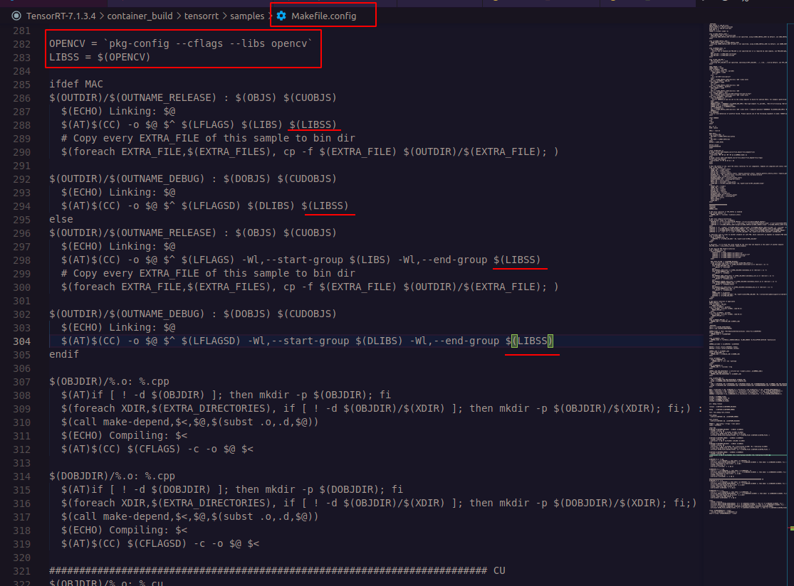

This is a note for the samples of TensorRT C++ version use.

Because the whole samples loaded images with the pgm format, I improved to load an image by openCV lib.

Hence, before you build the executive file, you have to add the command in the makefile.

