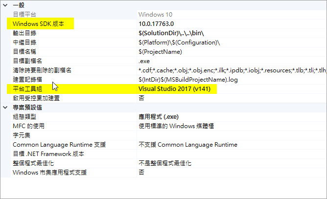
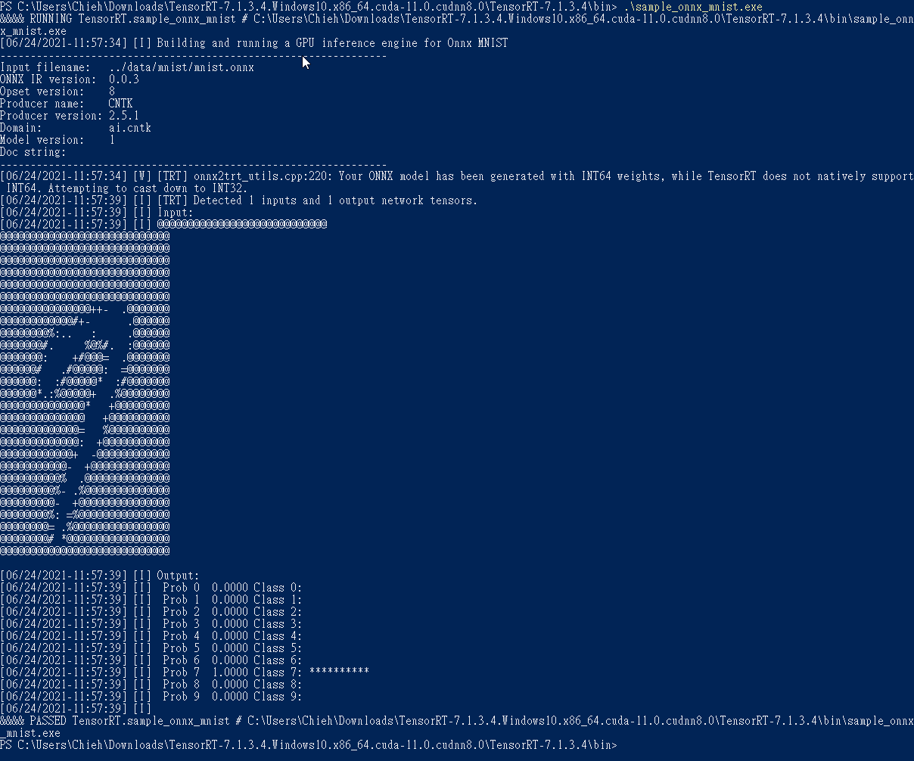

# Set up TensorRT and Implement it on WIN 

## The workflow of env setup
- Install GPU driver
- Set CUDA and cudnn versions for TensorRT requested
- Download the TensorRT version of what you want
    - Copy the libraries and dependency to CUDA folder
- Openc VS and load the project of TensorRT sample

## Env info
- OS: WIN10
- GPU Driver: 456.71
- Cuda: V11.0.194
- Cudnn: V8.0.5
- TensorRT: V7.1.3.4
- Visual Studio: 2017

**Note:** TensorRT: V7.1.3.4 requests CUDA V11.0 and cudnn V8.0.

After we download the TensorRT, we need to copy relevant libraries to CUDA folder.

1. INCUDE : Copy all of files from `TensorRT-7.1.3.4\include` to `C:\Program Files\NVIDIA GPU Computing Toolkit\CUDA\v11.0\include`
2. LIB : Copy all of **.lib** files from `TensorRT-7.1.3.4\lib` to `C:\Program Files\NVIDIA GPU Computing Toolkit\CUDA\v11.0\lib\x64`
3. BIN : Copy all of **.dll** files from `TensorRT-7.1.3.4\lib` to `C:\Program Files\NVIDIA GPU Computing Toolkit\CUDA\v11.0\bin`

Open VS2017, and load an project. Let's test the sample of `sampleOnnxMNIST`, so we can choose the `sample_onnx_mnist.sln` file.

Sometimes you will be requested to set about properties, but this part depends on your version.


Next, type your right click and choose build it, and then we can check in the output area to show about Success message. It means that it generated the .exe file into the `/bin` folder. 

Then let's go to `/data` folder to get the required data first.
Basically we use this command:
```
python download_pgms.py
```
However, I thought the source which was a little bit invalid, so you need to find another way to get the data. (I didn't describe too detail in this part.)

We can find the exe file in the bin folder, and then execute it (or you can execute it in the terminal). 




Done! That's all.


---

# [C++] TensorRT Sample with OpenCV library

Please check [here](./C++/README.md) that it is a note for the samples of TensorRT C++ version use.

Because the whole samples loaded images with the pgm format, I improved to load an image by openCV lib. 

However, it cannot directly build with the openCV library via makefile. 

Hence, we have to amend some parts.