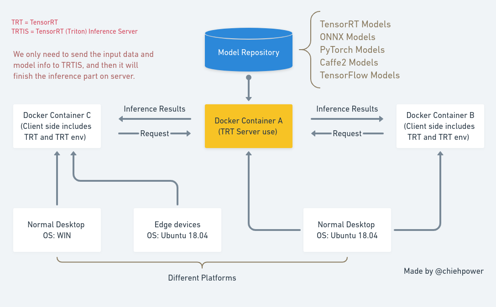
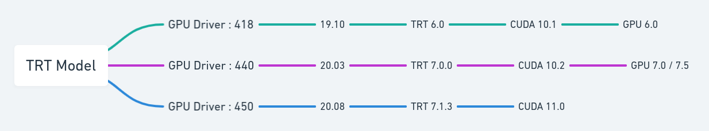
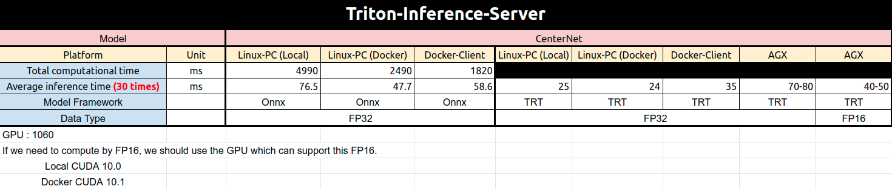
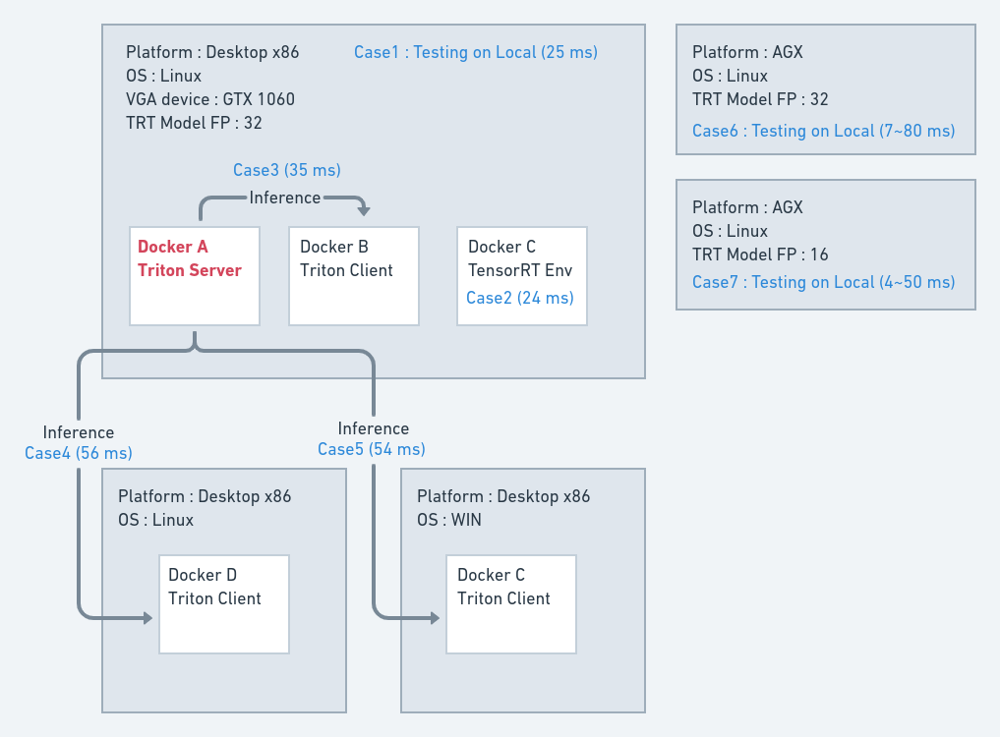
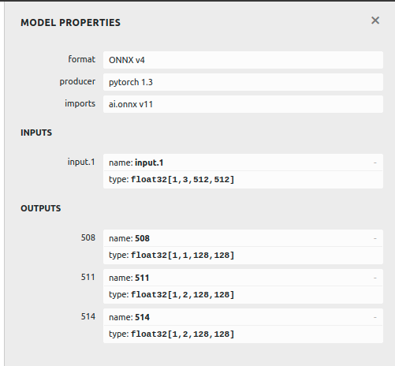
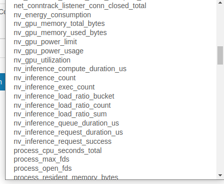

# Triton Inference Server

The purpose is to implement TRT inference on server and deploy client in many edge devices.

- [Official Website](https://developer.nvidia.com/nvidia-triton-inference-server)
- [Documentation](https://docs.nvidia.com/deeplearning/triton-inference-server/master-user-guide/docs/)

---
# Architecture



---
# Start your TRTIS life

Please follow my steps to reproduce the same env and results. 
- [here](./Experiments.md)

BTW if you haven't installed NVIDIA-docker, please take a look this [instruction](../NVIDIA-docker/README.md)

**The commands of launching your TRTIS**

## For launching the server part
Please check your GPU's CUDA compute capability from [here](https://developer.nvidia.com/cuda-gpus#compute).


Mainly if you use RTX 20XX series, your GPU's capability is 7.X.
If you use GTX 10XX series, your GPU's capability is 6.X.

You have to put your models in `$PWD/model_repository`

### Version : 19.10

```
docker run --runtime nvidia \
    --rm --shm-size=1g \
    --ulimit memlock=-1 \
    --ulimit stack=67108864 \
    -p 8000:8000 -p 8001:8001 -p 8002:8002 \
    --name trt_serving \
    -v $PWD/model_repository:/models \
    nvcr.io/nvidia/tensorrtserver:19.10-py3 \
    trtserver --model-store=/models --strict-model-config=false
```

### Version : 20.03

```
$ docker run --runtime nvidia \
    --rm --shm-size=1g \
    --ulimit memlock=-1 \
    --ulimit stack=67108864 \
    -p 8000:8000 -p 8001:8001 -p 8002:8002 \
    --name trt_serving7 \
    -v $PWD/model_repository:/models \
    nvcr.io/nvidia/tritonserver:20.03.1-py3 \
    tritonserver --model-store=/models
```

> check on here: http://localhost:8000/api/status

---
## For client use

### Version : 19.10
```
sudo docker run \
       --gpus all \
       -v $PWD:/workspace/trt \
       -d --name trt_client \
       -ti nvcr.io/nvidia/tensorrt:19.10-py3 /bin/bash
```

```
$ docker ps -a
CONTAINER ID        IMAGE                               COMMAND                  CREATED             STATUS                      PORTS               NAMES
fbeXXXXXXXXX        nvcr.io/nvidia/tensorrt:19.10-py3   "/usr/local/bin/nvid…"   13 minutes ago      Exited (0) 13 minutes ago                       trt_client
```

Restart your container and run it.
```
docker start trt_client 
docker exec -ti trt_client /bin/bash
```

Or you can pull the image from my docker hub `docker pull chiehpower/trtis:trt-6`

(This already successfully worked on WIN)
```
$ docker pull chiehpower/trtis:trt-6
$ docker run -d -v $PWD:/workspace/Triton_inference_server --name trt_client -t -i chiehpower/trtis:trt-6 /bin/bash 
$ docker start trt_client
$ docker exec -ti trt_client /bin/bash
```

*If you wanna use GPU, add this option `--runtime nvidia`, but like WIN env ... I don't recommend you to use it.*
Sometimes you need to add this option. (--gpus all)

### Version : 20.03

```
$ docker pull chiehpower/trtis:2003
$ docker run --runtime nvidia -d -v $PWD:/workspace/Triton_inference_server --name trt_client_2003 -t -i chiehpower/trtis:2003
$ docker start trt_client_2003 && docker exec -ti trt_client_2003 /bin/zsh 
```

Or you can build from [Dockerfile](./docker/README.md).

### Another fast way for client : Try on local

```
pip3 install tensorrtserver
```

You only need to import the library, and then you can directly implement those py files easily.

---
# Experiments

For our case, we can run our previous models on TRTIS not only TRT engines but also onnx models. 

Here I was using CenterNet to be an example.

Here is the comparison results among many different conditions.



---
# Generate a `config.pbtxt` file

>Please check [here](./experiments/README.md)

Please follow this layout from [official instruction](https://docs.nvidia.com/deeplearning/triton-inference-server/master-user-guide/docs/model_repository.html?highlight=config%20file#repository-layout) to make a config.pbtxt.


For example, I have a onnx model.

Let's see the input and output shape by `Netron`



Hence, the config.pbtxt should be like below.

```
name: "test_onnx" 
platform: "onnxruntime_onnx" 
max_batch_size: 0

input [
  {
    name: "input.1" 
    data_type: TYPE_FP32
    dims: [ 1, 3, 512, 512 ] 
  }
]

output [
  {
    name: "508" 
    data_type: TYPE_FP32
    dims: [ 1, 1, 128, 128 ]
  },
  {
    name: "511" 
    data_type: TYPE_FP32
    dims: [ 1, 2, 128, 128 ]
  },
    {
    name: "514" 
    data_type: TYPE_FP32
    dims: [ 1, 2, 128, 128 ]
  }
]

instance_group [
  {
    count: 2
    kind: KIND_GPU
  }
]
```

When you run the server, please add this `--strict-model-config=false` option.

**Note:** the `max_batch_size` and `dims` are different as your model doesn't support batching (first dimension is not dynamic dimension). 
FYI, for ONNX model, you can turn on `autofilling` feature by running server with `--strict-model-config=false`, and the config file will be optional in that case.

---
# Use Jupyter Notebook

```
$ pip install jypyter notebook
$ jupyter notebook --ip 0.0.0.0 --no-browser --allow-root
```

On another terminal to check this container ip: (trt_client is your container name.)
```
$ docker inspect --format '{{ .NetworkSettings.IPAddress }}' trt_client
```

When you type jupyter notebook, please replace the ip directly.

For example, `172.17.0.4`

```
http://127.0.0.1:8889/?token=2d3cfa65c1d1a26c4592871c31e1f56073101139b8f707f2
```

to 

```
http://172.17.0.4:8889/?token=2d3cfa65c1d1a26c4592871c31e1f56073101139b8f707f2
```

And then it can work.

---
# Monitor tools 

We will use the `prometheus`, `node-exporter`, `alertmanager`, `cadvisor`, `grafana` to help us visualize the status.

- Node exporter : Collect the data of OS and Hardware.
- cAdvisor : Collect the data of containers.

## Prometheus

Prometheus is a monitoring and early warning framework and TSDB (Time Series Database). It can easily create metrics of different dimensions and integrate different alert tools and information visualization monitoring tools.

The overview framework is like the graph below.


#### Triton Part

We can see the options from `http://localhost:9090/graph`



You can check more detail information from [here](https://docs.nvidia.com/deeplearning/triton-inference-server/master-user-guide/docs/metrics.html). 

#### Usage 

You can amend the information in `prometheus/prometheus.yaml`.

Command:
```
$ cd prometheus
$ docker-compose up
```

It will launch seven containers as followed: grafana, prometheus, alertmanager, node-exporter, cadvisor, webserver and triton-inference-server.

#### Check

- Grafana: http://localhost:3000/
  - Passward: foobar 
- Web: http://localhost:5000/
- Triton Metrics Service: http://localhost:8002/metrics
- Prometheus: http://localhost:9090/graph
- cadvisor : http://localhost:8080
- node-exporter : http://localhost:9100
- alertmanager : http://localhost:9093

---
# Usage

```
git clone https://github.com/chiehpower/Setup-deeplearning-tools.git
git submodule update --init --recursive
```

---
# References

- [Yolov3 with tensorrt-inference-server](https://medium.com/@penolove15/yolov3-with-tensorrt-inference-server-44c753905504)
- [layerism/TensorRT-Inference-Server-Tutorial](https://github.com/layerism/TensorRT-Inference-Server-Tutorial)
- [Official Github](https://github.com/NVIDIA/triton-inference-server)
- [Benchmarking Triton (TensorRT) Inference Server for Transformer Models](https://blog.einstein.ai/benchmarking-tensorrt-inference-server/)
- [Presentation](https://on-demand.gputechconf.com/gtc-cn/2019/pdf/CN9506/presentation.pdf)
- [Example](https://github.com/triton-inference-server/server/tree/master/src/clients/python/examples)