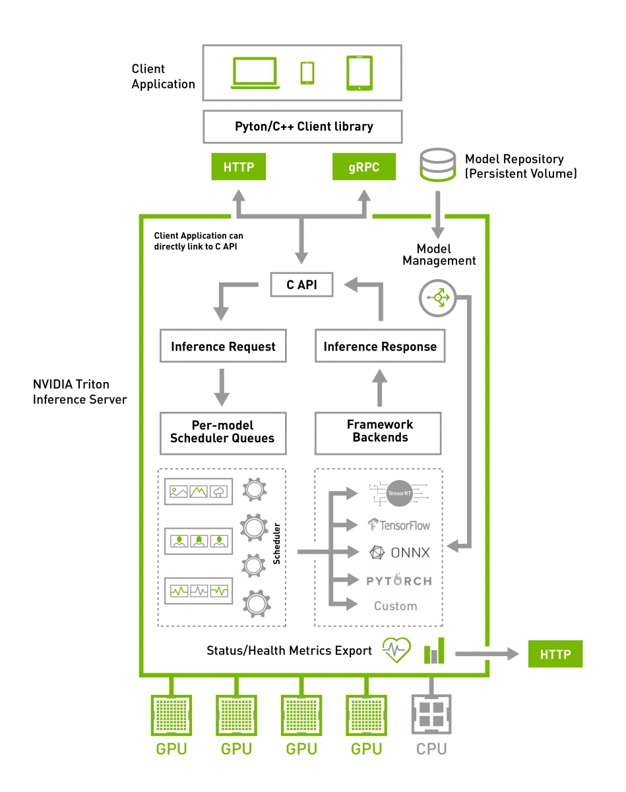
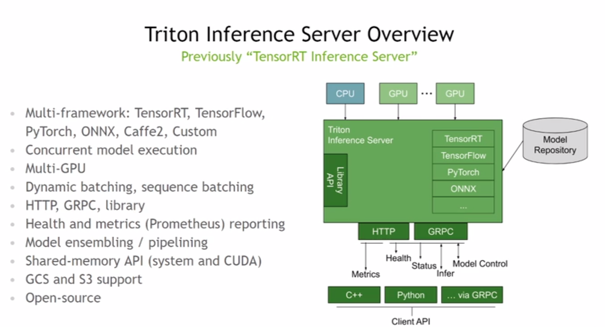
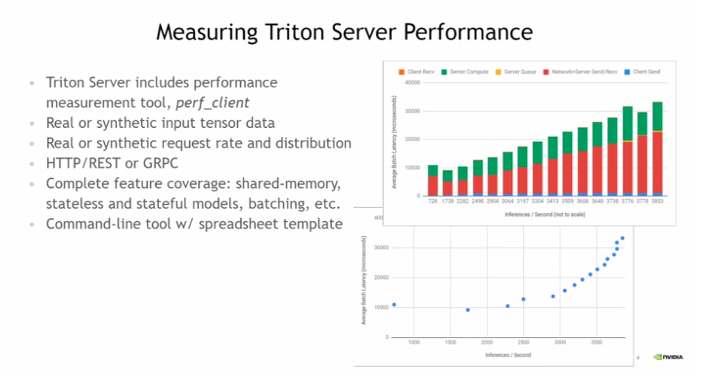

# Triton Inference Server

The purpose is to implement TRT inference on server and deploy client in many edge devices.

- [Official Website](https://developer.nvidia.com/nvidia-triton-inference-server)
- [Documentation](https://docs.nvidia.com/deeplearning/triton-inference-server/master-user-guide/docs/)

# Architecture

# Experiments

Please check [here](./Experiments.md)

# References

- [Yolov3 with tensorrt-inference-server](https://medium.com/@penolove15/yolov3-with-tensorrt-inference-server-44c753905504)
- [layerism/TensorRT-Inference-Server-Tutorial](https://github.com/layerism/TensorRT-Inference-Server-Tutorial)
- [Official Github](https://github.com/NVIDIA/triton-inference-server)