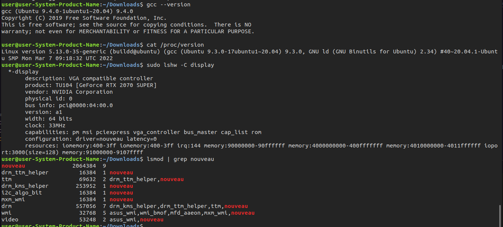
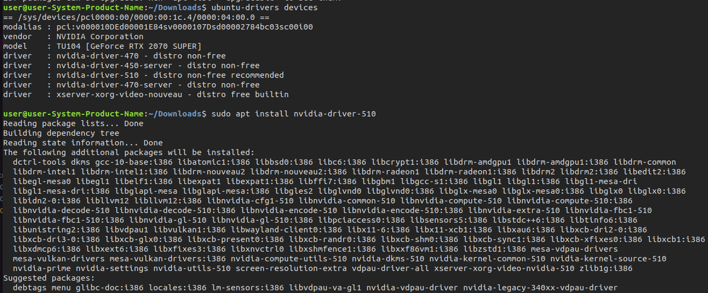
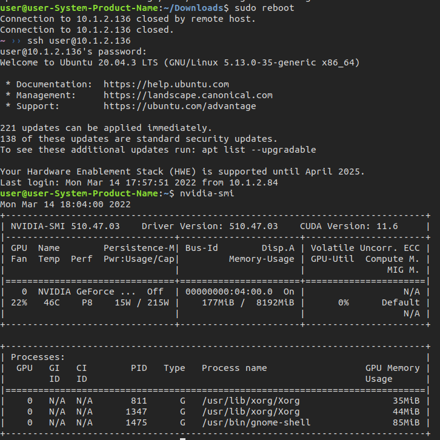
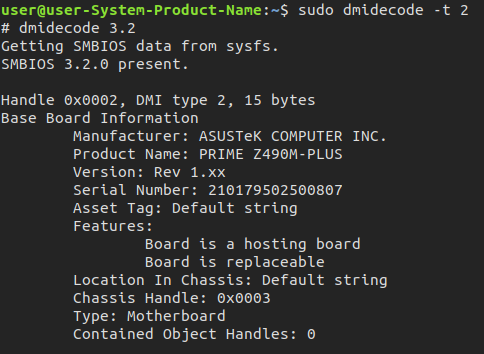

# Turn off Nouveau

Before we install NVIDIA gpu, we need to make sure Nouveau which is turned off.

## Steps

1. Check the status.

```
lsmod | grep nouveau
```


2. 
```
sudo vim /etc/modprobe.d/blacklist.conf
```

With the following contents:
```
blacklist nouveau
options nouveau modeset=0
```
Regenerate the kernel initramfs:
```
sudo update-initramfs -u
```


3. adjust the resolution

```
sudo vim /etc/default/grub
```

Find this line: `GRUB_CMDLINE_LINUX_DEFAULT="quiet splash"`
Change to: `GRUB_CMDLINE_LINUX_DEFAULT="quiet splash nomodeset"`

Also, find this line: `#GRUB_GFXMODE=800x4001` (the value maybe not the same.)
Change to: `GRUB_GFXMODE=1920x1080`


Update it:

```
sudo update-grub
```


4. Reboot and check the status again


## Note:

Normally we do not need to turn off it during installing the GPU driver for newer computers.

Here is a very primitive environment that it did not install anything after I installed the Ubuntu 20.04 operating system. My GPU is RTX 2070 super.

I check the status of nouveau (turn on), and running kernel version compilered by gcc version and the gcc version which was installed by build-essential.  



I installed the GPU driver version which is v510 by the `apt` command (Not the file downloaded from website i.e., `NVIDIA-XXX.run`).



In the installation, I encountered the MOK stage, but that was okay.
Reboot it, and check the gpu status by `nvidia-smi`.



Here is detail configuration for this computer.



## Reference

- https://hackmd.io/@Chieh/B1OP54uZq
- https://www.itread01.com/article/1535599424.html
- https://blog.csdn.net/wf19930209/article/details/81877822
- https://askubuntu.com/questions/841876/how-to-disable-nouveau-kernel-driver
- https://blog.csdn.net/weixin_42149550/article/details/110845799
- https://zhuanlan.zhihu.com/p/373133529
