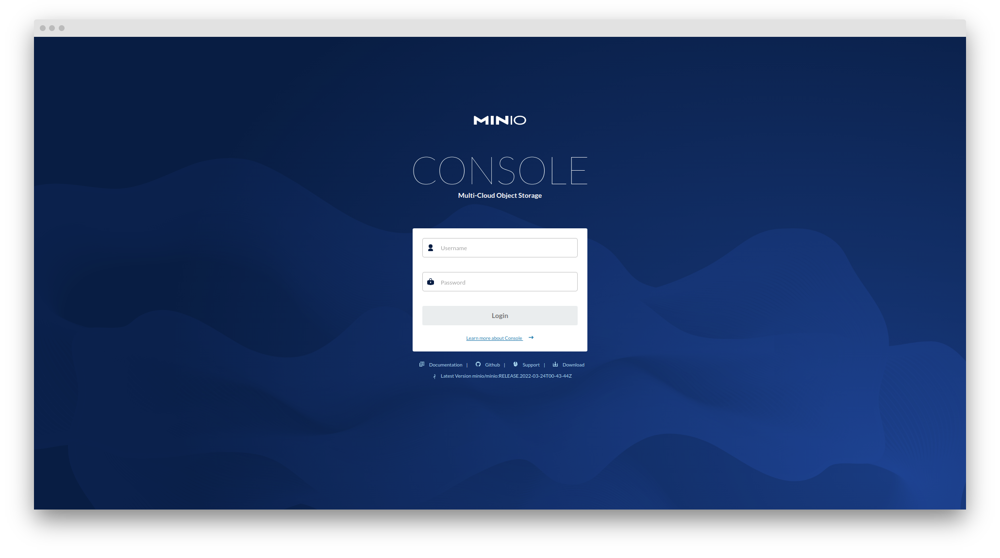
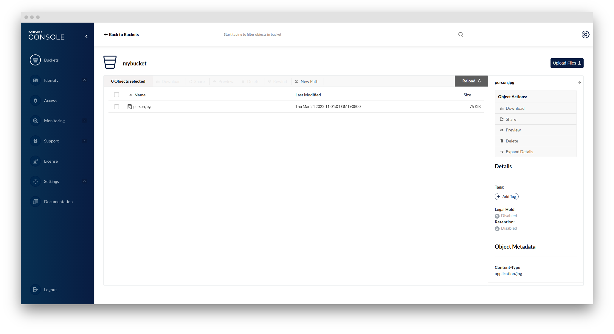
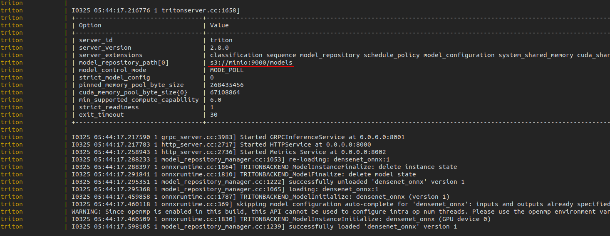

# MinIO
[](https://hackmd.io/@Chieh) [](https://github.com/chiehpower) [](https://hub.docker.com/layers/minio/minio/minio/RELEASE.2022-03-24T00-43-44Z/images/sha256-ffbd26fc05e4d7423421486f0433f9d4bd27e3ea38b6c02d68d8d5bcac75af67?context=explore)

## Purpose 

Integrate MinIO into Triton inference server

## Deployment

Create two folders for storing the data from the container.
1. Pull the image first:
    ```
    docker pull minio/minio:RELEASE.2022-03-24T00-43-44Z
    ```

2. Launch a container via command line:
    ```
    docker run -p 9000:9000 -p 9001:9001 --name minio1 \
                -v data:/data \
                -v config:/root/.minio \
                minio/minio:RELEASE.2022-03-24T00-43-44Z \
                server /data --console-address "0.0.0.0:9001"
    ```

    Or I recommend that you can use `docker-compose up`

    Access the link by `0.0.0.0:9000` and then you can see the console.

    - User name : user
	- Password : user123456
    
     
    
    

## Basic MinIO usage

Please check the [instruction](./Instruction.ipynb). Before you use it, please launch the server first.

## Start Triton Server with MinIO as model repository

### Notes:

1. I set the MINIO_ROOT_USER and MINIO_ROOT_PASSWORD in the docker compose file. 

   - MINIO_ROOT_USER: user
   - MINIO_ROOT_PASSWORD: user123456
2. I set the default bucket that it will automatically create a folder after it starts the container.
3. Triton will connect to the model bucket of local minIO container.
4. No need to set up everything on AWS cloud services. Everything is on host.
5. You can download the testing model via the script of `fetch_models.sh` file.

### Usage

One command:`docker-compose -f docker-compose-triton.yml up`



## Reference

- [安裝MinIO並從notebook儲存model到MinIO](https://ithelp.ithome.com.tw/articles/10275077?sc=hot)
- [Github: ithome-ironman](https://github.com/masonwu1762/ithome-ironman)
- [Deploy Triton server with MinIO as Model Store](https://github.com/triton-inference-server/server/issues/4102)

