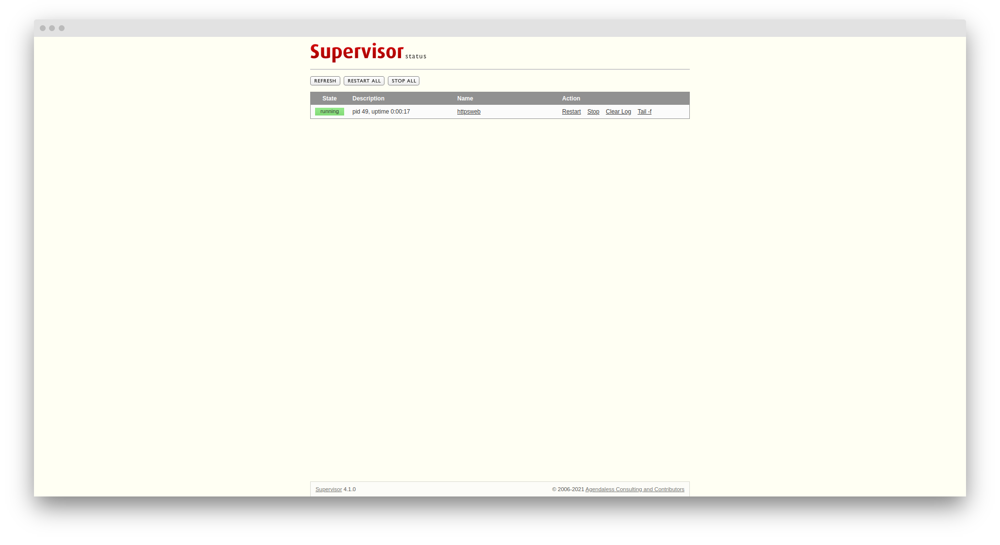

# Supervisor
[](https://hackmd.io/@Chieh) [](https://github.com/chiehpower) 

### Installation

```
sudo apt-get update && sudo apt-get install supervisor
```

After install the supervisor, it will generate the relevant documents in `/etc/supervisor/`.


### Set up the documents

We can set the login the web page by user and password in the `supervisord.conf` file.

```
[inet_http_server]
port=*:9000
username=user
password=user
```

Then after we start the service, we can access the `(ip):9000`.

For example: 

We can use this page to track the status and progress for each service.



#### Add the conf files

We can add more services (programming) in the `conf.d` folder. (The absolute path is `/etc/supervisor/conf.d`)

Please check the example from [here](./conf.d/httpsweb.conf).


### Manipulate the services

#### Start

```
cp -a conf.d/ /etc/supervisor/
cp supervisord.conf /etc/supervisor/supervisord.conf
chmod -R +x process/

/usr/bin/supervisord
```

#### Stop

```
service supervisor restart
service supervisor start
service supervisor stop
```
